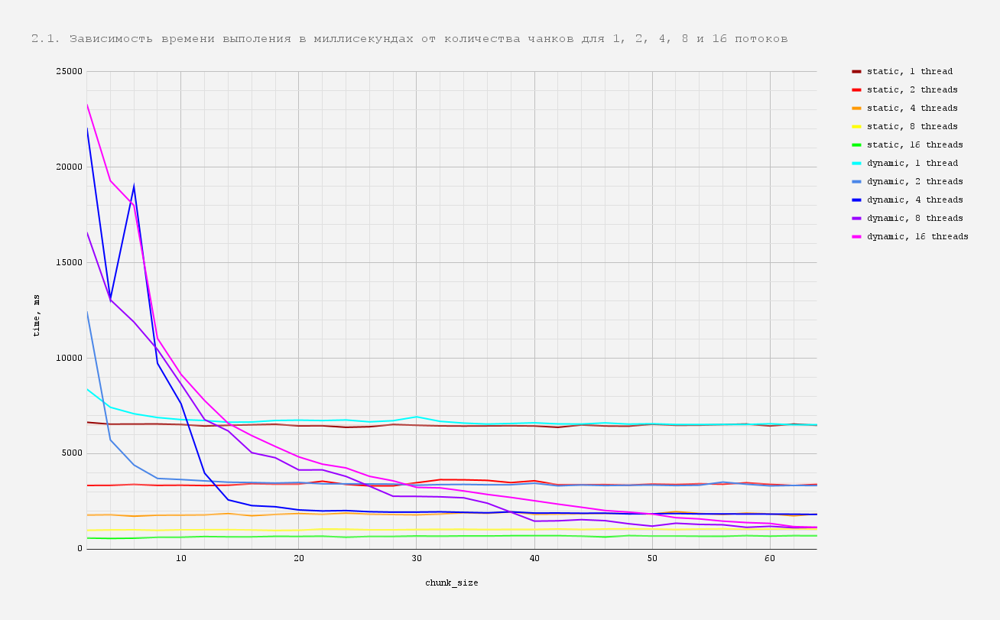

# OpenMP Monte Carlo Volume Calculation

Проект реализует вычисление объема трехмерного тела методом Монте-Карло с использованием OpenMP для параллельных вычислений.

## Особенности

- Реализация на C++20 с использованием OpenMP 2.0
- Оптимизированный генератор случайных чисел Park-Miller
- Поддержка многопоточных вычислений
- Анализ производительности разных стратегий планирования OpenMP
- Подробные тесты и бенчмарки

## Требования

- Компилятор с поддержкой C++20 (gcc 10+)
- Библиотека OpenMP
- CMake 3.12+

## Использование

Программа поддерживает следующие параметры командной строки:

```bash
--no-omp          # Запуск без OpenMP
--omp-threads N   # Использование N потоков OpenMP (или 'default')
--input FILE      # Входной файл с количеством итераций
--output FILE     # Выходной файл для результата
```

Пример входного файла:
```
100000000
```

## Результаты производительности

Производительность тестировалась на AMD Ryzen 7 4800H. Наилучшие результаты достигаются при использовании:
- `schedule(static)` или `schedule(dynamic, 256)`
- 16 потоков
- Время выполнения: ~550 мс для 100 млн итераций

Подробные результаты и графики приведены в [отчете].

# Детальный отчёт

## Инструментарий
- **C++20**
- **gcc**
- **OpenMP 2.0**
- **AMD Ryzen 7 4800H**

## Что реализовано

Выполнена полная версия работы. Созданы две функции для реализации 
с OpenMP ```double OMPMonteCarlo(uint64_t threads_number, const char* input_filename, const char* output_filename)``` 
и без OpenMP ```double MonteCarlo(const char* input_filename, const char* output_filename)```. 
Создана своя потокобезопасная функция рандома ```uint32_t ParkMillerRandom(uint32_t& seed)```,
которая работает возможно и не так рандомно как встроенные, но намного быстрее них. 
Функция ```void Parse(int argc, char** argv, uint64_t& threads_number, std::string& input_filename, std::string& output_filename)``` распаршивает аргументы программы.

# Описание:

Для начала опишу как всё устроено.

### Реализация
Сначала аргументы программы вместе со ссылками на переменные количества потоков **threads_number**, имени входного файла **input_filename**, имени выходного **output_filename**
подаются функции Parse, которая просто просматривает все аргументы и записывает по ссылкам значения.
Если что-то идет не по сценарию, то выводится "parse error", и программа завершается с кодом 1.

Затем значения **threads_number**, **input_filename**, **output_filename** передаются в функцию ```void Execute(uint64_t threads_number, const std::string& input_filename, const std::string& output_filename)```.
Там **STARTS_NUMBER** раз исполняется функция с OpenMP или без в зависимости от значения **threads_number**, 
и выводится количество потоков и усредненное количество миллисекунд по всем **STARTS_NUMBER** запускам функции.

В реализации функции с OpenMP сначала кладем в переменную время начала: ```double start = omp_get_wtime();```.
Затем получаем границы тела, объём которого будем считать: ```const float* axis_range = get_axis_range();```.
Получаем количество итераций из входного файла:
```
std::ifstream input(input_filename);
uint64_t accuracy_number;
input >> accuracy_number;
input.close();
```
Заводим переменные:
- ```uint64_t hits_sum = 0;``` - общая сумма попаданий в тело по всем потокам;
- ```uint64_t hits;``` - переменная для подсчета количества попаданий в тело в каждом конкретном потоке;
- ```uint64_t thread_number;``` - переменная для записи номера потока в каждом потоке;
- ```uint32_t thread_seed;``` - переменная для записи начального значения рандома - имеет свое уникальное значение в каждом потоке;

Начинается распараллеленная область:
- ```#pragma omp parallel ...``` - обозначает, что следующая часть кода в фигурных скобках будет исполняться на разных потоках 


Аргументы:
1. ```firstprivate(hits)``` - делаем переменную **hits** локальной для каждого потока, при том инициализируем её значением до параллельной конструкции
2. ```private(thread_number, thread_seed)``` - делаем переменные **thread_number**, **thread_seed** локальными для каждого потока
3. ```default(shared)``` - делаем другие переменные из глобальной области по умолчанию
4. ```num_threads(threads_number)``` - устанавливаем количество потоков

- ```hits = 0;``` - обнуляем hits для каждого потока
- ```thread_number = omp_get_thread_num();``` записываем в **thread_number** номер данного потока с помощью функции ```omp_get_thread_num()``` из **omp.h**
- ```thread_seed = (thread_number + 1) * static_cast<uint64_t>(std::chrono::system_clock::to_time_t(std::chrono::system_clock::now()));``` - 
уникальное для каждого потока начальное число для генерации рандома равное текущему времени умноженному на номер потока.
- ```#pragma omp for ...``` - конструкция OpenMP для цикла. Приводит к тому, что работа в цикле for внутри параллельного региона будет разделена между потоками.
  - ```nowait``` - без него на конце каждой итерации цикла стоит **#pragma barrier**, что немного замедляет программу. 
  **nowait** же отключает неявный барьер. (барьер синхронизирует все потоки в команде; 
  все потоки приостанавливаются на барьере, пока остальные потоки не придут к нему.)
  - ```schedule(dynamic, CHUNK_SIZE)``` - аргумент **schedule**. В нём указывается **static** или **dynamic** и **chunk_size**:
    - **static** без **chunk_size** – статическое планирование. При использовании такой опции итерации цикла будут примерно поровну поделены между потоками. Нулевой поток получит первые *n / p* итераций, первый – вторые и т.д.
    - **static** с **chunk_size** – блочно-циклическое распределение итераций. Каждый поток получает **chunk_size** итераций в начале цикла, затем если остались итерации процедура распределения продолжается. Планирование выполняется один раз, при этом каждый поток “узнает” итерации которые должен выполнить
    - **dynamic** - динамическое планирование. По умолчанию **chunk_size** равен 1. Каждый поток получает **chunk_size** итераций, выполняет их и запрашивает новую порцию. Планирование выполняется многократно во время выполнения программы. Конкретное распределение итераций между потоками зависит от темпов работы потоков и трудоемкости итераций
      


- ```if (hit_test(...))``` - на каждой итерации генерируем случайную точку в пространстве, ограниченном **axis_range**, и проверяем находится ли она внутри тела данной функцией. Если находится, то увеличиваем hits.
- ```#pragma omp atomic hits_sum += hits;``` - после цикла в конце нам нужно сложить все вычисленные локальные результаты **hits** в одну переменную. 
Делаем это при помощи **atomic**. Он не позволяет случиться **race condition** и корректно складывает всё в **hits_sum**. 
Определяет переменную, операция с которой должна быть выполнена как неделимая. 
**atomic** плохо влияет на производительность, но, так как мы вызываем его после цикла, 
то есть всего **threads_number** раз, то это (вроде) нам не сильно мешает.
Директива **atomic** работает быстрее, чем критические секции, поскольку некоторые атомарные операции могут быть напрямую заменены командами процессора. 
Следовательно, эту директиву желательно применять везде, где требуется защита общей памяти при элементарных операциях, в том числе и **+=**, как здесь.

В конце просто выводим объём, равный объёму параллелепипеда, в который вписано тело умноженному на отношение количества попавших точек к количеству всех точек, то есть количеству итераций.
Возвращаем итоговое время работы.

В версии без OpenMP всё аналогично, только без OpenMP.

В моей реализации в лучшем случае на ноутбучном процессоре **AMD Ryzen 7 4800H** при включенной зарядке, но параллельно запущенных некоторых других процессах, при оптимальной конфигурации **schedule(static)** или **schedule(dynamic, 256)** и **16** включенных потоках, программа выдаёт примерно **550мс**

### Random

Каждую итерацию цикла в каждом потоке нам приходится трижды генерировать значение типа с плавающей точкой. Понятно, что
это довольно важная часть кода и при правильной реализации основное время уходит на генерацию случайных чисел. 
Если взять обычный встроенный рандом из C++11 random library, то время выполнения будет довольно большим. 
Так как по ТЗ нам это важно, я написал свой рандом. 
Главными требованиями были к нему потоко-безопасность, скорость и равномерное равновероятное распределение точек в области ```get_axis_range()```.

```uint32_t ParkMillerRandom(uint32_t& seed)``` является линейно конгруэнтным генератором **(LCG)**, который работает в мультипликативной группе целых чисел по модулю m.
Что это значит? Во-первых, он применяется в простых случаях и не обладает криптографической стойкостью, которая нам особо и не нужна.
По сути, он умножает текущее число на какое-то большое число и возвращает результат обратно в диапазон модуля. 
Результат, конечно, довольно предсказуем, но для наших целей он не так уж и связан с предыдущими, недавними и последующими результатами, 
чтобы быть важным в наших условиях, требующих чего-то близкого к случайности.

Наиболее удобными константами взятия по модулю для компьютеров являются целые степени двойки. 
Если вычисления выполняются с точностью, например 32 бита, и требуется выполнить **% (2^31)**, то вычислить результат несложно, 
очистив самый левый бит. Аналогично, **% (2^32)** очень удобен для машин с 32-битными регистрами - 
вычисления просто игнорируют переполнение, оставляя остаток, который является модулем.
Напомню, что наш генератор использует константу для деления по модулю 2^31 - 1 = 0x7FFFFFFF = 2147483647.

Множитель в **LCG** может быть любым положительным целым числом, обычно меньшим, чем константа для деления по модулю. 
Большинство чисел не приводят к хорошим результатам, поскольку генерируемая ими серия зацикливается в маленьком множестве значений. 
Иногда возникает несколько циклов, в зависимости от начального числа, с которого запускается алгоритм.

Правильно подобранные константы для умножения _(**a** в литературе)_ и для взятия результата по модулю _(**m** в литературе)_ могут 
генерировать последовательность, в которой будут все числа от **1** до **m - 1** и все будут повторяться ровно один раз. 
Для этого **a**, возведенная в 1-ю, 2-ю и т.д. степень до **m**, должны быть равны значениям, которое при делении на **m** дают разные остатки.
Минимальное подходящее число для этого **a = 16807** в сочетании с прежде выбранным **m = 2147483647**. Собственно, в честь
того, что эти константы были предложены в качестве минимального стандарта Стивеном Парком и Кейтом Миллером, рандом так и назван.

В данном случае константы, которы были предложены Стивеном Парком и Кейтом Миллером это 16807 в умножении и 2147483647 при взятии модуля.
К тому же, это не обычный рандом Парка Миллера. Реализована оптимизация Дэвида Карта: с 32-битной арифметикой и без деления.
Он предложил генерировать 46-битное произведение умножения в двух частях:
- ```lo``` — младшие 31 бит: от 30 до 0.
- ```hi``` — старшие 15 бит: от 45 до 31.

Вместо того чтобы рассматривать их как 46-битное значение, 
которое необходимо умножить на 0x7FFFFFFF и вычесть из него целое число 0x7FFFFFFFF, он предположил, 
что правильный результат можно получить, просто добавив ```hi``` к ```lo```, а затем выполнить **% 0x7FFFFFF** для 32-битного результата.

Это по итогу очень позитивно сказывается на времени. Примерно 30 тактовых циклов процессора. За счёт этого рандом быстрый.

Со скоростью разобрались. Что насчёт потоко-безопасности? 
В начале каждой параллельной области до начала цикла создается приватное для неё значение,
зависящее от времени и номера потока. Для каждого потока оно свое и у всех потоков они разные, поэтому, даже несмотря
на предсказуемость нашего рандома, во всех потоках нет повторяющихся цепочек. Да и, честно говоря, в данной задаче, это
как будто не так важно. Рандом, как ранее говорилось, проходит по всем значениям от 0 до **m - 1** по одному разу, 
то есть все числа равновероятны, а, так как мы считаем объём методом Монте Карло, и нам требуется такое равномерное распределение,
то результат будет всегда корректный. Протестировав свой алгоритм очень много раз, о чём будет рассказано в следующем пункте,
я убедился в том, что число считается действительно корректным сравнив со значением объема тела вращением, вычисленным при помощи
определенного интеграла конкретно для тела: ***x^4 - 2 * x^3 + 4 * (y^2 + z^2) <= 0***

### Тесты и наблюдения

Я потестировал свою программу и составил несколько графиков: [tests_data.xlsx](src/tests_data.xlsx)

Там, где точное количество итераций не указано, **N = 100000000**.

#### Что можно сказать по графикам.

#### 1.1. 
Начнём с первого графика. На нём изображена зависимость _времени выполнения_ от _количества потоков_ для конфигурации **static** и **dynamic** без указания **chunk_size**. 
Как мы видим со **static**-ом всё хорошо. Там по умолчанию без указания **chunk_size** количество итераций поровну делится по потокам. Но в **dynamic**
по умолчанию стоит единица, и с ним у меня происходит что-то странное.
У меня все хорошо, когда я увеличиваю **chunk_size**, и график **dynamic** тогда приближается к графику **static**, что
наталкивает на мысль, что проблема в маленьком **chunk_size**. 
Как я понимаю, динамический планировщик добавляет дополнительные накладные расходы на синхронизацию, 
необходимые для атомарного распределения итераций между потоками, поэтому, когда низкий **chunk_size** тратится очень много
времени на синхронизацию по одной итерации на поток. Из чего можно так же сделать вывод, что 
динамический планировщик более подходит, когда возникают проблемы с балансировкой нагрузки, 
т.е. одни потоки выполняют больше работы, чем другие, что не в нашем случае. 
В нашем коде потоки должны выполнять примерно одинаковый объем работы, поэтому лучше будет использовать **static**.


#### 1.2. - 1.3. 
На втором и третьем графиках же показана зависимость _времени выполнения_ от _количества
итераций_ для **16** потоков. На первом оба варианта **dynamic** и **static** берутся без chunk_size. 
Здесь можем проследить, как плохо синхронизация в **dynamic** влияет на производительность.
Если же сделать у **dynamic** chunk_size = iterations_number / threads_number, то, конечно, по сути мы получим тот же **static**,
что можно проследить на графике **1.3.** - графики почти совпадают. Так же можем заметить, что время растет линейно, из
чего следует что время растет прямо пропорционально количеству итераций, что казалось бы очевидно, но в моей прошлой
реализации график больше походил на кусок параболы или показательную функцию при **a > 1**.


#### 2.1. 
Здесь показана зависимость _времени выполнения_ от _количества чанков_ для **static** и **dynamic** для **1, 2, 4, 8 и 16**
потоков у каждого. Мы снова можем подтвердить ранее выдвинутую гипотезу. Если у **static**-а все графики смахивает на горизонтальную
прямую, то у **dynamic**-а снова в игру входит синхронизация между потоками, которая критично понижает производительность
на маленьких чанках. Ну и как я писал ранее, с ростом чанков показатель времени **dynamic** стремится к показателю **static**.
Как будто **lim(time_dynamic) = time_static** при **x->inf**.



#### 2.2. - 2.3.
Ну и для интереса _зависимость времени_ от _количества итераций_ для разных **chunk_siz-ов**. Здесь особо ничего не скажешь,
кроме как то, что время всё ещё растет линейно и у низких чанков на **dynamic**-е рост намного быстрее. Для наглядности,
я добавил **dynamic**-и с **чанками >= 128**. Видно, что их графики мало чем отличаются от **static**.


#### 3.1.
Зависимость _времени_ от _количества чанков_ для **1** потока и без **OpenMP**. Снова видно, что **dynamic** резко падает с увеличением чанков,
в итоге все три встают примерно в одну линию, что не удивительно. Поток же и примерное поведение одни во всех случаях, 
только **dynamic** что-то мутит с чанками.


#### 3.2.
Зависимость _времени_ от _количества итераций_ для **1** потока. Здесь совсем ничего интересного. Всё уже было обговорено ранее.


#### 4.1.
Зависимость _времени_ от _количества потоков_ при наиболее оптимальных конфигурациях schedule. Я выбрал три наиболее понравившихся
мне варианта: **(dynamic, 256)**, **(static, 256)** и **(static)**. Все они показывают примерно одинаковое время. В любом случае я бы
рекомендовал использовать обычный **static**, к тому же он более подходящий для нашей задачи. Ну, очевидно время падает с
ростом количества потоков. График похож на **1/x**. Оно и понятно, ведь мы распараллеливаем процессы на **x** частей, то есть
всё операции делятся на x потоков, график не должен быть похожим на **-x**.


## Таблицы данных:

1. **При различных значениях числа потоков при одинаковом параметре schedule* (без chunk_size)**

| 1.1     | static   | dynamic  | | 1.2.              | static   | dynamic  | | 1.3.              | static   | dynamic, chunk_size = iterations_number / threads number |
|---------|----------|----------|-|-------------------|----------|----------|-|-------------------|----------|----------------------------------------------------------|
| threads | time, ms | time, ms | | iterations number | time, ms | time, ms | | iterations number | time, ms | time, ms                                                 |
| 1       | 6408     | 10773    | | 0                 | 1        | 1        | | 0                 | 1        | 2                                                        |
| 2       | 3272     | 24030    | | 4194304           | 32       | 1152     | | 4194304           | 32       | 22                                                       |
| 3       | 2251     | 16414    | | 8388608           | 63       | 2492     | | 8388608           | 63       | 66                                                       |
| 4       | 1699     | 16249    | | 12582912          | 87       | 3837     | | 12582912          | 87       | 86                                                       |
| 5       | 1397     | 16575    | | 16777216          | 94       | 5427     | | 16777216          | 94       | 105                                                      |
| 6       | 1168     | 17076    | | 20971520          | 112      | 6747     | | 20971520          | 112      | 128                                                      |
| 7       | 1035     | 18046    | | 25165824          | 133      | 8120     | | 25165824          | 133      | 167                                                      |
| 8       | 926      | 18930    | | 29360128          | 155      | 9062     | | 29360128          | 155      | 189                                                      | 
| 9       | 881      | 20434    | | 33554432          | 178      | 10349    | | 33554432          | 178      | 179                                                      |
| 10      | 808      | 21585    | | 37748736          | 207      | 12881    | | 37748736          | 207      | 198                                                      |
| 11      | 744      | 24062    | | 41943040          | 231      | 13209    | | 41943040          | 231      | 215                                                      |
| 12      | 697      | 27054    | | 46137344          | 248      | 13930    | | 46137344          | 248      | 240                                                      |
| 13      | 651      | 31407    | | 50331648          | 266      | 15418    | | 50331648          | 266      | 313                                                      |
| 14      | 610      | 32962    | | 54525952          | 293      | 16693    | | 54525952          | 293      | 297                                                      |
| 15      | 589      | 32573    | | 58720256          | 318      | 19299    | | 58720256          | 318      | 348                                                      |
| 16      | 544      | 32042    | | 62914560          | 338      | 21465    | | 62914560          | 338      | 321                                                      |
| 17      | 690      | 23680    | | 67108864          | 360      | 23751    | | 67108864          | 360      | 348                                                      |
| 18      | 654      | 29412    | | 71303168          | 381      | 24146    | | 71303168          | 381      | 369                                                      |
| 19      | 713      | 28430    | | 75497472          | 406      | 25105    | | 75497472          | 406      | 393                                                      |
| 20      | 673      | 29605    | | 79691776          | 428      | 27467    | | 79691776          | 428      | 412                                                      |
| 21      | 653      | 32235    | | 83886080          | 451      | 28802    | | 83886080          | 451      | 438                                                      |
| 22      | 688      | 31324    | | 88080384          | 478      | 30303    | | 88080384          | 478      | 459                                                      |
| 23      | 716      | 32753    | | 92274688          | 499      | 31622    | | 92274688          | 499      | 483                                                      |
| 24      | 690      | 29605    | | 96468992          | 522      | 32941    | | 96468992          | 522      | 526                                                      |
| 25      | 682      | 29931    | | 100663296         | 547      | 34714    | | 100663296         | 547      | 564                                                      |
| 26      | 672      | 31632    | | 104857600         | 570      | 36050    | | 104857600         | 570      | 571                                                      |
| 27      | 671      | 31943    | | 109051904         | 598      | 37628    | | 109051904         | 598      | 594                                                      |
| 28      | 676      | 32344    | | 113246208         | 623      | 39079    | | 113246208         | 623      | 621                                                      |
| 29      | 643      | 31993    | | 117440512         | 641      | 40609    | | 117440512         | 641      | 643                                                      |
| 30      | 652      | 31234    | | 121634816         | 667      | 41922    | | 121634816         | 667      | 661                                                      |
| 31      | 628      | 31432    | | 125829120         | 741      | 43112    | | 125829120         | 741      | 690                                                      |
| 32      | 648      | 31765    | | 130023424         | 761      | 43914    | | 130023424         | 761      | 716                                                      |

2. **При одинаковом значении числа потоков при различных параметрах schedule* (с chunk_size)**

| 2.1            | static    |           |           |                    |            | dynamic   |           |                    |           |            |
|----------------|-----------|-----------|-----------|--------------------|------------|-----------|-----------|--------------------|-----------|------------|
| threads number | 1 threads | 2 threads | 4 threads | 8 threads          | 16 threads | 1 threads | 2 threads | 4 threads          | 8 threads | 16 threads |
| chunk_size     | time, ms  | time, ms  | time, ms  | time, ms           | time, ms   | time, ms  | time, ms  | time, ms           | time, ms  | time, ms   |
| 1              | 6644      | 3339      | 1791      | 994                | 589        | 10406     | 21609     | 23350              | 21810     | 32074      |
| 2              | 6544      | 3346      | 1805      | 1011               | 567        | 8380      | 12456     | 22062              | 16594     | 23290      |
| 4              | 6551      | 3394      | 1731      | 1018               | 581        | 7429      | 5720      | 13100              | 13056     | 19283      |
| 6              | 6553      | 3344      | 1784      | 993                | 626        | 7091      | 4409      | 18976              | 11891     | 17992      |
| 8              | 6525      | 3353      | 1789      | 1018               | 630        | 6893      | 3705      | 9731               | 10452     | 11034      |
| 10             | 6453      | 3333      | 1800      | 1021               | 663        | 6785      | 3648      | 7615               | 8646      | 9153       |
| 12             | 6488      | 3353      | 1864      | 1026               | 649        | 6738      | 3578      | 3982               | 6785      | 7781       |
| 14             | 6511      | 3428      | 1757      | 1011               | 650        | 6647      | 3509      | 2583               | 6192      | 6591       |
| 16             | 6537      | 3408      | 1822      | 988                | 673        | 6658      | 3492      | 2284               | 5054      | 5948       |
| 18             | 6459      | 3410      | 1867      | 999                | 669        | 6738      | 3465      | 2224               | 4789      | 5379       |
| 20             | 6465      | 3561      | 1829      | 1049               | 679        | 6756      | 3494      | 2058               | 4148      | 4832       |
| 22             | 6383      | 3394      | 1889      | 1044               | 634        | 6734      | 3426      | 2004               | 4154      | 4453       |
| 24             | 6412      | 3317      | 1835      | 1019               | 669        | 6765      | 3425      | 2024               | 3812      | 4256       |
| 26             | 6526      | 3317      | 1817      | 1018               | 669        | 6668      | 3418      | 1964               | 3301      | 3816       |
| 28             | 6490      | 3481      | 1803      | 1032               | 689        | 6727      | 3409      | 1941               | 2773      | 3581       |
| 30             | 6459      | 3642      | 1840      | 1039               | 681        | 6930      | 3351      | 1944               | 2766      | 3238       |
| 32             | 6451      | 3634      | 1912      | 1042               | 694        | 6692      | 3382      | 1958               | 2744      | 3211       |
| 34             | 6457      | 3604      | 1879      | 1031               | 691        | 6602      | 3392      | 1931               | 2691      | 3051       |
| 36             | 6465      | 3487      | 1957      | 1039               | 706        | 6552      | 3373      | 1906               | 2411      | 2868       |
| 38             | 6453      | 3583      | 1828      | 1037               | 706        | 6582      | 3376      | 1957               | 1942      | 2713       |
| 40             | 6383      | 3374      | 1842      | 1059               | 709        | 6617      | 3456      | 1894               | 1471      | 2538       |
| 42             | 6505      | 3374      | 1854      | 1037               | 686        | 6560      | 3317      | 1897               | 1488      | 2361       |
| 44             | 6453      | 3383      | 1867      | 1060               | 645        | 6554      | 3365      | 1885               | 1549      | 2197       |
| 46             | 6442      | 3351      | 1868      | 1067               | 712        | 6613      | 3333      | 1888               | 1496      | 2027       |
| 48             | 6544      | 3416      | 1846      | 1062               | 692        | 6550      | 3350      | 1850               | 1334      | 1943       |
| 50             | 6490      | 3389      | 1964      | 1037               | 695        | 6567      | 3361      | 1858               | 1210      | 1844       |
| 52             | 6494      | 3429      | 1874      | 1058               | 685        | 6531      | 3333      | 1871               | 1361      | 1651       |
| 54             | 6526      | 3405      | 1822      | 1068               | 681        | 6528      | 3352      | 1849               | 1300      | 1588       |
| 56             | 6553      | 3478      | 1894      | 1052               | 712        | 6532      | 3516      | 1847               | 1280      | 1470       |
| 58             | 6453      | 3397      | 1853      | 1057               | 689        | 6531      | 3402      | 1845               | 1147      | 1396       |
| 60             | 6551      | 3335      | 1751      | 1070               | 712        | 6567      | 3317      | 1840               | 1201      | 1352       |
| 62             | 6486      | 3396      | 1847      | 1050               | 707        | 6513      | 3340      | 1835               | 1127      | 1184       |
| 64             | 6509      | 3374      | 2090      | 1016               | 706        | 6519      | 3332      | 1821               | 1143      | 1153       |
|                |           |           |           |                    |            |           |           |                    |           |            |
| 128            | 6413      | 3269      | 1674      | 974                | 596        | 6432      | 3247      | 1781               | 939       | 602        |
| 192            | 6398      | 3385      | 1698      | 988                | 623        | 6400      | 3318      | 1801               | 944       | 601        |
| 256            | 6500      | 3312      | 1683      | 1035               | 637        | 6457      | 3360      | 1815               | 979       | 649        |

| 2.2. - 2.3.       | static   |          |          |          |          |          |          |          |          | dynamic  |          |          |          |          |          |          |          |          |
|-------------------|----------|----------|----------|----------|----------|----------|----------|----------|----------|----------|----------|----------|----------|----------|----------|----------|----------|----------|
| chunk_size        | 1        | 32       | 64       | 96       | 128      | 160      | 192      | 224      | 256      | 1        | 32       | 64       | 96       | 128      | 160      | 192      | 224      | 256      |
| iterations number | time, ms | time, ms | time, ms | time, ms | time, ms | time, ms | time, ms | time, ms | time, ms | time, ms | time, ms | time, ms | time, ms | time, ms | time, ms | time, ms | time, ms | time, ms |
| 0                 | 1        | 1        | 1        | 1        | 1        | 1        | 1        | 1        | 1        | 1        | 1        | 1        | 1        | 1        | 1        | 1        | 1        | 1        |
| 4194304           | 36       | 28       | 25       | 28       | 25       | 23       | 27       | 35       | 32       | 1152     | 118      | 61       | 37       | 28       | 25       | 27       | 24       | 25       |
| 8388608           | 70       | 50       | 50       | 70       | 53       | 51       | 52       | 62       | 59       | 2259     | 237      | 124      | 74       | 58       | 51       | 51       | 51       | 50       |
| 12582912          | 143      | 76       | 79       | 94       | 116      | 76       | 83       | 95       | 86       | 4162     | 351      | 185      | 108      | 84       | 82       | 77       | 76       | 77       |
| 16777216          | 144      | 103      | 104      | 114      | 117      | 100      | 102      | 109      | 110      | 5766     | 489      | 245      | 143      | 114      | 105      | 103      | 101      | 100      |
| 20971520          | 137      | 136      | 125      | 129      | 171      | 125      | 125      | 134      | 130      | 7264     | 580      | 331      | 176      | 146      | 134      | 128      | 137      | 126      |
| 25165824          | 166      | 174      | 152      | 173      | 191      | 154      | 152      | 168      | 157      | 8722     | 712      | 371      | 211      | 167      | 161      | 162      | 156      | 150      |
| 29360128          | 197      | 200      | 176      | 209      | 200      | 176      | 175      | 207      | 177      | 10152    | 866      | 429      | 240      | 191      | 184      | 188      | 180      | 174      |
| 33554432          | 221      | 210      | 213      | 218      | 267      | 204      | 200      | 240      | 232      | 11989    | 970      | 494      | 269      | 218      | 235      | 202      | 208      | 202      |
| 37748736          | 247      | 270      | 223      | 246      | 236      | 223      | 251      | 266      | 259      | 13306    | 1115     | 560      | 309      | 244      | 240      | 231      | 238      | 230      |
| 41943040          | 278      | 246      | 247      | 281      | 307      | 250      | 283      | 263      | 278      | 15041    | 1252     | 598      | 336      | 278      | 269      | 260      | 255      | 248      |
| 46137344          | 308      | 279      | 277      | 317      | 314      | 274      | 329      | 331      | 314      | 16551    | 1336     | 669      | 377      | 291      | 298      | 298      | 277      | 273      |
| 50331648          | 353      | 302      | 302      | 316      | 312      | 298      | 348      | 348      | 302      | 17865    | 1513     | 634      | 426      | 331      | 315      | 320      | 345      | 298      |
| 54525952          | 357      | 348      | 322      | 370      | 408      | 322      | 338      | 339      | 322      | 19276    | 1625     | 673      | 453      | 356      | 343      | 340      | 342      | 322      |
| 58720256          | 384      | 402      | 349      | 362      | 380      | 346      | 352      | 369      | 403      | 18979    | 1819     | 858      | 501      | 383      | 373      | 375      | 365      | 346      |
| 62914560          | 409      | 393      | 372      | 380      | 384      | 372      | 391      | 380      | 446      | 20969    | 1904     | 926      | 535      | 450      | 424      | 410      | 413      | 372      |
| 67108864          | 450      | 398      | 432      | 399      | 440      | 397      | 403      | 402      | 446      | 23449    | 2015     | 988      | 551      | 434      | 454      | 445      | 496      | 397      |
| 71303168          | 496      | 421      | 450      | 431      | 433      | 429      | 425      | 483      | 521      | 24927    | 2177     | 1038     | 605      | 464      | 490      | 477      | 466      | 422      |
| 75497472          | 492      | 446      | 450      | 450      | 446      | 443      | 456      | 454      | 549      | 26404    | 2283     | 1038     | 626      | 528      | 488      | 465      | 480      | 453      |
| 79691776          | 524      | 474      | 474      | 493      | 469      | 471      | 469      | 573      | 552      | 27882    | 2352     | 1064     | 673      | 610      | 502      | 560      | 478      | 477      |
| 83886080          | 574      | 490      | 494      | 600      | 493      | 495      | 498      | 593      | 539      | 29359    | 2521     | 1135     | 695      | 570      | 527      | 547      | 530      | 512      |
| 88080384          | 607      | 517      | 518      | 564      | 523      | 518      | 625      | 540      | 618      | 30837    | 2585     | 1237     | 730      | 581      | 548      | 585      | 535      | 560      |
| 92274688          | 622      | 542      | 603      | 697      | 547      | 543      | 584      | 660      | 643      | 32314    | 2692     | 1293     | 772      | 614      | 604      | 607      | 550      | 578      |
| 96468992          | 639      | 567      | 627      | 619      | 574      | 577      | 604      | 599      | 640      | 33791    | 2838     | 1244     | 824      | 694      | 645      | 603      | 571      | 579      |
| 100663296         | 700      | 589      | 607      | 670      | 634      | 596      | 657      | 595      | 606      | 35269    | 2972     | 1285     | 852      | 722      | 633      | 612      | 597      | 597      |
| 104857600         | 711      | 628      | 631      | 660      | 667      | 615      | 646      | 711      | 627      | 36746    | 3187     | 1326     | 874      | 672      | 694      | 634      | 622      | 620      |
| 109051904         | 821      | 690      | 648      | 680      | 711      | 641      | 690      | 715      | 645      | 38224    | 3205     | 1356     | 938      | 698      | 730      | 706      | 646      | 645      |
| 113246208         | 822      | 682      | 677      | 689      | 779      | 668      | 690      | 822      | 706      | 39701    | 3322     | 1474     | 926      | 729      | 719      | 696      | 675      | 669      |
| 117440512         | 853      | 718      | 706      | 785      | 742      | 695      | 695      | 836      | 722      | 41179    | 3446     | 1494     | 961      | 757      | 836      | 709      | 698      | 693      |
| 121634816         | 828      | 731      | 819      | 788      | 805      | 716      | 790      | 744      | 742      | 42656    | 3572     | 1673     | 1015     | 785      | 818      | 759      | 736      | 718      |
| 125829120         | 872      | 739      | 845      | 838      | 864      | 744      | 880      | 802      | 766      | 43134    | 3695     | 1744     | 1055     | 816      | 896      | 782      | 757      | 742      |
| 130023424         | 850      | 799      | 869      | 862      | 851      | 768      | 846      | 789      | 811      | 44072    | 3845     | 1804     | 1069     | 834      | 818      | 803      | 780      | 766      |

3. **C выключенным openmp и с включенным с 1 потоком (chunk_size = 256)**

| 3.1        | no OpenMP | static   | dynamic  | | 3.2               | no OpenMP | static   | dynamic  |
|------------|-----------|----------|----------|-|-------------------|-----------|----------|----------|
| chunk_size | time, ms  | time, ms | time, ms | | iterations number | time, ms  | time, ms | time, ms |
| 1          | 6426      | 6606     | 10487    | | 0                 | 1         | 1        | 1        |
| 8          | 6426      | 6487     | 6907     | | 4194304           | 282       | 270      | 270      |
| 16         | 6426      | 6452     | 6633     | | 8388608           | 553       | 539      | 547      |
| 24         | 6426      | 6430     | 6550     | | 12582912          | 822       | 818      | 810      |
| 32         | 6426      | 6438     | 6499     | | 16777216          | 1090      | 1064     | 1087     |
| 40         | 6426      | 6398     | 6515     | | 20971520          | 1362      | 1334     | 1345     |
| 48         | 6426      | 6407     | 6473     | | 25165824          | 1639      | 1619     | 1646     |
| 56         | 6426      | 6393     | 6442     | | 29360128          | 1974      | 1915     | 1894     |
| 64         | 6426      | 6399     | 6425     | | 33554432          | 2195      | 2146     | 2190     |
| 72         | 6426      | 6408     | 6464     | | 37748736          | 2485      | 2425     | 2482     |
| 80         | 6426      | 6386     | 6411     | | 41943040          | 2728      | 2728     | 2731     |
| 88         | 6426      | 6395     | 6407     | | 46137344          | 3019      | 3003     | 2984     |
| 96         | 6426      | 6384     | 6495     | | 50331648          | 3256      | 3245     | 3207     |
| 104        | 6426      | 6400     | 6579     | | 54525952          | 3593      | 3523     | 3512     |
| 112        | 6426      | 6380     | 6496     | | 58720256          | 3818      | 3788     | 3810     |
| 120        | 6426      | 6380     | 6576     | | 62914560          | 4125      | 4005     | 4148     |
| 128        | 6426      | 6378     | 6465     | | 67108864          | 4401      | 4368     | 4354     |
| 136        | 6426      | 6374     | 6427     | | 71303168          | 4680      | 4568     | 4618     |
| 144        | 6426      | 6413     | 6481     | | 75497472          | 4929      | 4943     | 4868     |
| 152        | 6426      | 6401     | 6438     | | 79691776          | 5218      | 5135     | 5176     |
| 160        | 6426      | 6383     | 6474     | | 83886080          | 5481      | 5459     | 5412     |
| 168        | 6426      | 6430     | 6431     | | 88080384          | 5707      | 5707     | 5672     |
| 176        | 6426      | 6535     | 6453     | | 92274688          | 5989      | 5927     | 5862     |
| 184        | 6426      | 6489     | 6457     | | 96468992          | 6231      | 6191     | 6154     |
| 192        | 6426      | 6487     | 6477     | | 100663296         | 6585      | 6423     | 6383     |
| 200        | 6426      | 6430     | 6580     | | 104857600         | 6811      | 6675     | 6645     |
| 208        | 6426      | 6398     | 6401     | | 109051904         | 7098      | 7010     | 6954     |
| 216        | 6426      | 6393     | 6383     | | 113246208         | 7355      | 7218     | 7194     |
| 224        | 6426      | 6483     | 6342     | | 117440512         | 7600      | 7481     | 7471     |
| 232        | 6426      | 6445     | 6376     | | 121634816         | 8005      | 7806     | 7704     |
| 240        | 6426      | 6400     | 6386     | | 125829120         | 8177      | 8184     | 8012     |
| 248        | 6426      | 6380     | 6364     | | 130023424         | 8477      | 8385     | 8255     |
| 256        | 6426      | 6407     | 6391     | |                   |           |          |          |

4. **При оптимальной конфигурации schedule (определённой ранее) от числа потоков**

| 4.1     | dynamic, chunk_size = 256 | static, without chunk_size | static,  chunk_size = 256 |
|---------|---------------------------|----------------------------|---------------------------|
| threads | time, ms                  | time, ms                   | time, ms                  |
| 1       | 6374                      | 6428                       | 6546                      |
| 2       | 3306                      | 3289                       | 3266                      |
| 3       | 2233                      | 2227                       | 2290                      |
| 4       | 1714                      | 1739                       | 1768                      |
| 5       | 1409                      | 1391                       | 1523                      |
| 6       | 1216                      | 1187                       | 1255                      |
| 7       | 1063                      | 1038                       | 1115                      |
| 8       | 981                       | 968                        | 1050                      |
| 9       | 942                       | 875                        | 941                       |
| 10      | 845                       | 804                        | 836                       |
| 11      | 762                       | 758                        | 775                       |
| 12      | 716                       | 713                        | 743                       |
| 13      | 664                       | 670                        | 709                       |
| 14      | 632                       | 664                        | 680                       |
| 15      | 594                       | 598                        | 650                       |
| 16      | 565                       | 601                        | 652                       |
| 17      | 571                       | 650                        | 680                       |
| 18      | 610                       | 681                        | 681                       |
| 19      | 673                       | 684                        | 648                       |
| 20      | 667                       | 672                        | 629                       |
| 21      | 635                       | 694                        | 699                       |
| 22      | 622                       | 685                        | 734                       |
| 23      | 622                       | 668                        | 665                       |
| 24      | 600                       | 677                        | 710                       |
| 25      | 620                       | 682                        | 645                       |
| 26      | 614                       | 678                        | 688                       |
| 27      | 620                       | 667                        | 677                       |
| 28      | 620                       | 671                        | 666                       |
| 29      | 636                       | 640                        | 680                       |
| 30      | 634                       | 650                        | 671                       |
| 31      | 634                       | 675                        | 705                       |
| 32      | 648                       | 661                        | 685                       |